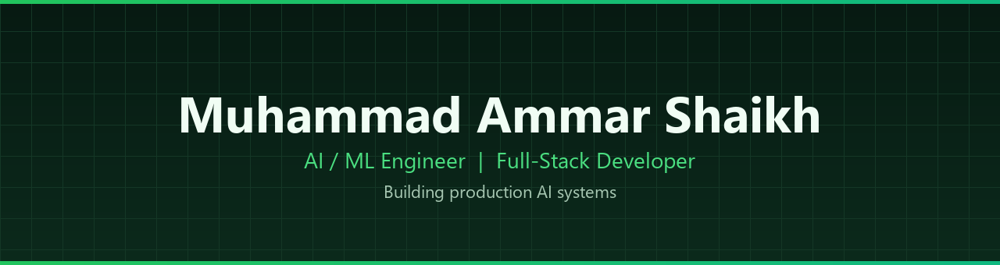

 

 

---

### About

I design and deliver **AI-powered products** across applied machine learning, LLM agents, and full-stack engineering.  
My work spans industrial monitoring, process automation, intelligent SaaS products, and production-ready ML systems.

**Core focus**
- Applied machine learning & predictive systems
- LLM / agent-based applications
- Full-stack AI product development
- Industrial monitoring & workflow automation

  

---

### Selected projects

- **[AI-Dialer-MVP](https://github.com/Ammar-Shaikh-00/AI-Dialer-MVP)** — SaaS AI dialer with analytics, user management, and call recording
- **[Predictive-Maintenance](https://github.com/Ammar-Shaikh-00/Predictive-Maintenance)** — Live extrusion monitoring with ML state classification and anomaly detection
- **[Trading-Bot-Signals](https://github.com/Ammar-Shaikh-00/Trading-Bot-Signals)** — Crypto signal suite for scalping and day/swing trading on Binance USDT perps
- **[Sunpor-AI-Maintenance](https://github.com/Ammar-Shaikh-00/Sunpor-AI-Maintenance)** — Process monitoring, anomaly scoring, and predictive quality for industrial extrusion
- **[MindVersa](https://github.com/Ammar-Shaikh-00/MindVersa)** — AI/ML agency platform and production systems — [mindversa.dev](https://www.mindversa.dev/)
- **[DU-Tracking-Automation](https://github.com/Ammar-Shaikh-00/DU-Tracking-Automation)** — Python automation for DU tracking workflows

---

### Stack

**Languages**

 Python
&nbsp;&nbsp;
 TypeScript
&nbsp;&nbsp;
 JavaScript
&nbsp;&nbsp;
 SQL
&nbsp;&nbsp;
 HTML5
&nbsp;&nbsp;
 CSS3

**AI / ML**

 PyTorch
&nbsp;&nbsp;
 scikit-learn
&nbsp;&nbsp;
 Hugging Face
&nbsp;&nbsp;
 OpenAI
&nbsp;&nbsp;
 OpenCV
&nbsp;&nbsp;
 NLP / Transformers

**Backend & APIs**

 FastAPI
&nbsp;&nbsp;
 Node.js
&nbsp;&nbsp;
 Express
&nbsp;&nbsp;
 REST API

**Frontend & Apps**

 React
&nbsp;&nbsp;
 Next.js
&nbsp;&nbsp;
 Streamlit
&nbsp;&nbsp;
 React Native
&nbsp;&nbsp;
 Tailwind CSS

**Data & Tooling**

 Pandas
&nbsp;&nbsp;
 NumPy
&nbsp;&nbsp;
 Jupyter
&nbsp;&nbsp;
 Docker
&nbsp;&nbsp;
 Git
&nbsp;&nbsp;
 Linux
&nbsp;&nbsp;
 VS Code

---

### Currently

- Building production AI systems at [MindVersa](https://www.mindversa.dev/)
- Developing industrial predictive maintenance and process-quality solutions
- Shipping automation, trading systems, and full-stack AI products

---

**Open to roles and collaborations** in AI/ML engineering and full-stack AI product development.

[m.ammarshaikh31@gmail.com](mailto:m.ammarshaikh31@gmail.com) · [LinkedIn](https://www.linkedin.com/in/ammar-shaikh-oo7) · [mindversa.dev](https://www.mindversa.dev/)

